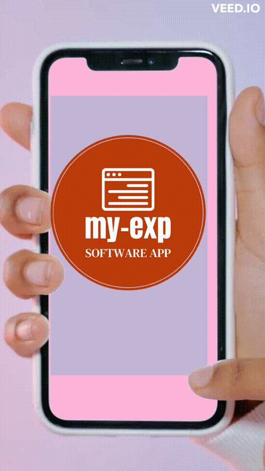

<a name="readme-top"></a>

<div align="center">

 <h3><b>Microverse README Template</b></h3>

</div>

<!-- TABLE OF CONTENTS -->

# 📗 Table of Contents

- [📖 About the Project](#about-project)
  - [🛠 Built With](#built-with)
    - [Tech Stack](#tech-stack)
    - [Key Features](#key-features)
  - [🖺 Entity Relationship Diagram](#er-diagram)
  - [📽️ Project Documentation](#pro-doc)
  - [🚀 Live Demo](#live-demo)
- [💻 Getting Started](#getting-started)
  - [Setup](#setup)
  - [Prerequisites](#prerequisites)
  - [Install](#install)
  - [Usage](#usage)
  - [Run tests](#run-tests)
  - [Deployment](#triangular_flag_on_post-deployment)
- [👥 Authors](#authors)
- [🔭 Future Features](#future-features)
- [🤝 Contributing](#contributing)
- [⭐️ Show your support](#support)
- [🙏 Acknowledgements](#acknowledgements)
- [❓ FAQ](#faq)
- [📝 License](#license)

<!-- PROJECT DESCRIPTION -->

# 📖 My-Exp <a name="about-project"></a>


**My-Exp** is a mobile web application that allows the user to:  
 - register and log in, so that the data is private to them.
 - Ceate categories for thier expenses.
 - record transactions associated with a category.
 - see the money spent on each category.
 - see the total money spent on all categories.

## 🛠 Built With <a name="built-with"></a>

### Tech Stack <a name="tech-stack"></a>

<details>
  <summary>Ruby</summary>
</details>

<details>
  <summary>Ruby on Rails</summary>
</details>

<details>
  <summary> Javascript </summary>
</details>

<details>
<summary>Database</summary>
  <ul>
    <li><a href="https://www.postgresql.org/">PostgreSQL</a></li>
  </ul>
</details>

<!-- Features -->

### Key Features <a name="key-features"></a>

- **Authentication - User must be authenticated**
- **Users can track expenses category-wise**
- **Users can see the total money spent on all categories**
- **Users expense data is private to them**

<p align="right">(<a href="#readme-top">back to top</a>)</p>

<!-- Project Documentation -->
## 📽️ Project Doocumentation <a name="pro-doc"></a>

<!-- LIVE DEMO -->

## 🚀 Live Demo <a name="live-demo"></a>

- [My-Exp](https://my-expenses-3hoz.onrender.com) 

- [video](https://www.loom.com/share/d17398b07917461e8659276a5500acc3)

<p align="right">(<a href="#readme-top">back to top</a>)</p>

<!-- GETTING STARTED -->

## 💻 Getting Started <a name="getting-started"></a>

To get a local copy up and running, follow these steps.
### Prerequisites

In order to run this project you need:
`Git` and `Ruby`
```
 gem install rails
```

### Install

Install this project with:

```sh
  bundle install
```
```sh
  npm install
```

Create Database (Mandatory)

```
rails db:create
```

If you have made a migration then run this command

```
rails db:migrate
```
```
rails db:seed
```
### Usage

To run the project, execute the following command:

```sh
  rails server or rails s  # after build
``` 

Run tests
```
rspec
```

<p align="right">(<a href="#readme-top">back to top</a>)</p>

<!-- AUTHORS -->

## 👥 Author <a name="author"></a>

👤 **Mulugeta M.**

- GitHub: [@belmeetmule](https://github.com/belmeetmule)
- Twitter: [@belmeetmule](https://twitter.com/belmeetmule)
- LinkedIn: [belmeetmule](https://linkedin.com/in/belmeetmule)

<p align="right">(<a href="#readme-top">back to top</a>)</p>

<!-- FUTURE FEATURES -->

## 🔭 Future Features <a name="future-features"></a>

- [ ] **[Notifications that pop up and close]**
- [ ] **[Implement side menu and User settings]**
- [ ] **[Implement most recent and anicient]**
- [ ] **[Implement picture upload]**

<p align="right">(<a href="#readme-top">back to top</a>)</p>

<!-- CONTRIBUTING -->

## 🤝 Contributing <a name="contributing"></a>

Contributions, issues, and feature requests are welcome!

Feel free to check the [issues page](../../issues/).

<p align="right">(<a href="#readme-top">back to top</a>)</p>

<!-- SUPPORT -->

## ⭐️ Show your support <a name="support"></a>

Give a ⭐️ if you like this project!

<p align="right">(<a href="#readme-top">back to top</a>)</p>

<!-- ACKNOWLEDGEMENTS -->

## 🙏 Acknowledgments <a name="acknowledgements"></a>

I would like to thank:
- [Microverse](https://microverse.org)
- Code reviewers
- Inspiration
   - [Vitor Guedes Madeira](https://github.com/VitorGuedesMadeira) 

Under the the [Creative Commons liscense](https://creativecommons.org/licenses/by-nc/4.0/)


Original design from [Gregoire Vella on Behance](https://www.behance.net/gregoirevella)

<p align="right">(<a href="#readme-top">back to top</a>)</p>

<!-- FAQ (optional) -->

## ❓ FAQ <a name="faq"></a>
- ** On what platform this app works ?**

  - Since it is a web mobile application, you can use it from your mobile-phone and personal computers too. In other words, you can use it from any devise or platfrom as long as it supports web-browser.

- **How to run this app after I cloned it to my local machine ?**

  - Start the sever by executing the command `rails server` from your terminal. And open up your browser and visit localhost:3000 

- **What prerequisites are required to run the app ?**

  - Since it is a RoR app make sure you have rails, ruby and postgresql are installed
- **[Question_1]**

  - [Answer_1]

- **[Question_2]**

  - [Answer_2]

<p align="right">(<a href="#readme-top">back to top</a>)</p>

<!-- LICENSE -->

## 📝 License <a name="license"></a>

This project is [MIT](./MIT.md) licensed.

<p align="right">(<a href="#readme-top">back to top</a>)</p>
